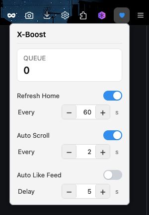
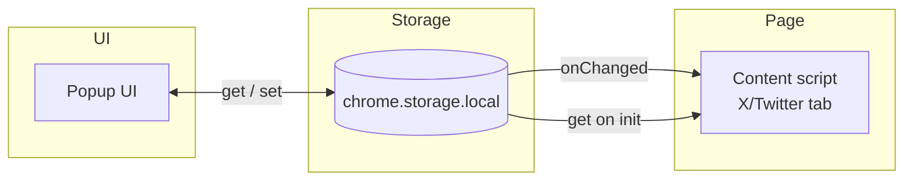
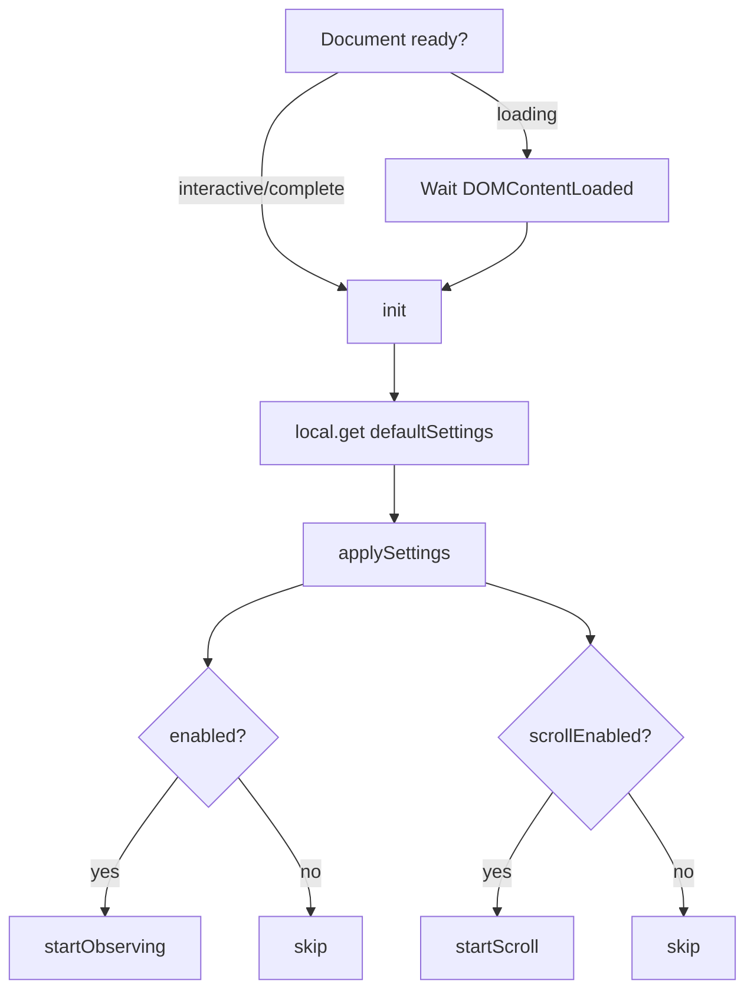
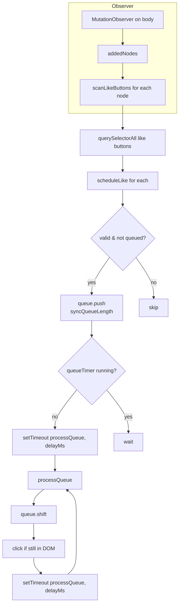
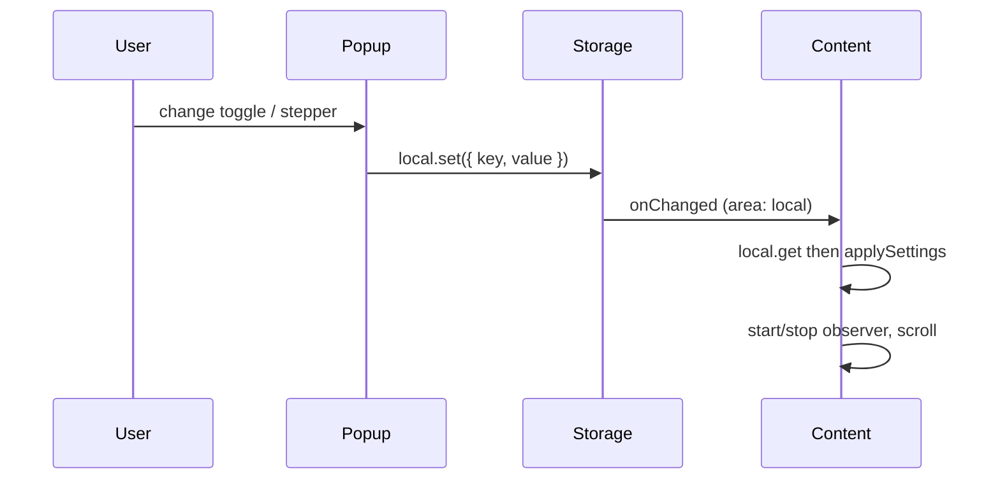

# X-Boost 

Browser extension for X (Twitter): auto-like timeline posts with a delay queue, optional auto-scroll and auto-refresh on the home feed. Settings are stored in `chrome.storage.local` and synced to the content script.

  

## Installation

Load the extension as an **unpacked** (developer) add-on.

### Firefox

1. Open **Firefox** (profile where you’re logged into X).
2. In the address bar go to **`about:debugging`** → Enter.
3. Click **“This Firefox”** in the left sidebar.
4. Click **“Load Temporary Add-on…”**.
5. Open the **X-Boost** folder and select **`manifest.json`** → Open.

The X-Boost icon appears in the toolbar; click it to open the popup.

> **Note:** The add-on is **temporary** — it is removed after restarting Firefox. Reload from step 1 after a restart. After code changes, open `about:debugging` again and click **Reload** on the X-Boost card.

### Chrome

1. Open **Chrome** and go to **`chrome://extensions`**.
2. Enable **“Developer mode”** (top right).
3. Click **“Load unpacked”**.
4. Select the **X-Boost** folder (the one containing `manifest.json`).

The extension loads; use the toolbar icon to open the popup.

> **Note:** After code changes, click the reload icon on the extension card.

## Overview

- **Single source of truth:** `chrome.storage.local`. Popup reads/writes storage; the content script (injected into X/Twitter tabs) reads storage on load and on `storage.onChanged` and drives all behaviour.
- **Features:** Auto-like (queue + MutationObserver), auto-scroll (smooth, configurable interval), auto-refresh (home only, configurable interval). When refresh is on, the extension icon shows a countdown (seconds until next reload). All can be toggled and tuned from the popup.
- **Queue:** Like buttons are queued and clicked one-by-one with a delay (1–10 s) to reduce rate-limit risk. The popup shows the current queue length.

## Architecture

### Data flow (storage-centred)

Popup reads/writes settings; the content script subscribes to `storage.onChanged` and loads settings once on init.

### Content script init

On load, the content script fetches settings and starts only the features that are enabled.

### Auto-like (queue + observer)

New DOM nodes (e.g. from infinite scroll) are scanned for like buttons; valid, non-queued buttons are pushed to a queue. A single timer runs `processQueue` every `delayMs`: it shifts one button, clicks it if still valid, then reschedules itself.

### Settings change (storage.onChanged)

When the user changes a setting in the popup, the content script receives `storage.onChanged`, fetches full storage and reapplies settings, then starts or stops the corresponding timers/observer. Refresh is driven by the background script (countdown + tab reload).

## Settings

| Setting         | Range / values | Description                           |
| --------------- | -------------- | ------------------------------------- |
| Auto Like Feed  | on / off       | Enable like queue and observer        |
| Delay           | 1–10 s         | Delay between each like click         |
| Refresh Home    | on / off       | Periodically reload the page on home  |
| Every (refresh) | 30–300 s       | Refresh interval                      |
| Auto Scroll     | on / off       | Periodically scroll the timeline down |
| Every (scroll)  | 2–15 s         | Scroll interval                       |

Defaults: delay 10 s, refresh 60 s, scroll 5 s. The popup configures all of the above. Queue length is shown in the popup.

## File structure

| File            | Role                                                                                                                                                        |
| --------------- | ----------------------------------------------------------------------------------------------------------------------------------------------------------- |
| `manifest.json` | Declares content scripts (X/Twitter URLs), storage and tabs permissions, popup, icon, background script.                                                    |
| `background.js` | Background script: badge countdown when Refresh Home is on; triggers tab reload when countdown hits 0; listens for `storage.onChanged` (refresh keys only). |
| `content.js`    | Injected into X/Twitter. Loads settings, runs queue + MutationObserver and scroll timer; listens for reload command from background.                        |
| `popup/`        | Popup UI: toggles and steppers for all settings; reads `queueLength` from storage for the queue stat.                                                       |
| `icons/`        | Extension icon (SVG).                                                                                                                                       |
| `preview/`      | Screenshot for README (`app.png`).                                                                                                                          |

## Requirements

- **Firefox:** 109+ (Gecko).
- **Chrome:** Standard Manifest V2 support.
- **Sites:** Runs only on `*://*.x.com/*` and `*://*.twitter.com/*` (home and timeline).

## License

This project is licensed under the MIT license. See the [LICENSE](./LICENSE) file for more info.
